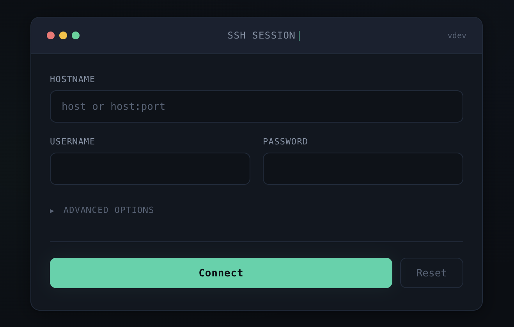

## WebSSH

A web-based SSH client with a modern terminal UI. Connect to SSH servers from your browser with password or key-based authentication, TOTP support, and optional per-user server-side key management.

Built on Python, Tornado, Paramiko, and xterm.js.



### Features

* Password and public-key authentication (RSA, ECDSA, Ed25519)
* Encrypted keys and TOTP two-factor authentication
* Per-user server-side SSH key generation and storage
* YAML configuration with host allowlisting and host key pinning
* Hostname:port shortcut in the connect form
* Username pre-filled from auth proxy header
* Fullscreen, resizable terminal with auto-detected encoding
* Modern dark terminal-inspired UI

### How it works

```
+---------+     http     +--------+    ssh    +-----------+
| browser | <==========> | webssh | <=======> | ssh server|
+---------+   websocket  +--------+    ssh    +-----------+
```

### Quick Start with Docker

```bash
docker run -d -p 8888:8888 ghcr.io/rgregg/webssh:latest
```

Then open `http://localhost:8888` in your browser.

### Configuration

WebSSH uses a YAML config file for most settings. Mount it at `/data/config.yaml` and it will be loaded automatically:

```bash
docker run -d -p 8888:8888 \
  -v ./config.yaml:/data/config.yaml:ro \
  ghcr.io/rgregg/webssh:latest
```

Example `config.yaml`:

```yaml
# Host key policy: reject, autoadd, or warning (default: warning)
policy: reject

# Restrict connections to specific hosts
hosts:
  - name: "Production Server"
    hostname: "10.0.1.5"
    port: 22
    host_key:
      - "ssh-ed25519 AAAAC3NzaC1lZDI1NTE5AAAA..."
      - "ssh-rsa AAAAB3NzaC1yc2EAAAA..."
  - name: "Database Server"
    hostname: "db.internal"
    port: 3022

# Per-user SSH key management
userkeydir: /data/user-keys
userheader: X-Authentik-Username

# Trusted proxy IPs (required when userkeydir is set)
trusted_proxies:
  - 10.0.0.1
```

See [config.yaml.example](config.yaml.example) for all options.

#### Host Key Pinning

Pin expected host keys so connections are rejected if the server key doesn't match. Get a host's keys with:

```bash
ssh-keyscan -t ed25519,rsa hostname
```

Or generate a config from your existing `known_hosts`:

```bash
python scripts/known_hosts_to_yaml.py ~/.ssh/known_hosts > config.yaml
```

#### Per-User SSH Keys

When `userkeydir` is configured, authenticated users can generate Ed25519 key pairs on the server and use them for connections without uploading a key file each time. The user's public key is displayed in the UI for copying to `authorized_keys` on target hosts.

Requires an auth proxy (e.g. Authentik) that sets a username header.

### Docker Compose

```yaml
services:
  webssh:
    image: ghcr.io/rgregg/webssh:latest
    ports:
      - "8888:8888"
    volumes:
      - ./config.yaml:/data/config.yaml:ro
      - webssh-keys:/data/user-keys
    restart: unless-stopped

volumes:
  webssh-keys:
```

### Deployment Behind a Reverse Proxy

```nginx
location / {
    proxy_pass http://webssh:8888;
    proxy_http_version 1.1;
    proxy_read_timeout 300;
    proxy_set_header Upgrade $http_upgrade;
    proxy_set_header Connection "upgrade";
    proxy_set_header Host $http_host;
    proxy_set_header X-Real-IP $remote_addr;
    proxy_set_header X-Real-PORT $remote_port;
}
```

### CLI Options

All settings can also be passed as command-line arguments:

```bash
wssh --address='0.0.0.0' --port=8888 --policy=reject --config=/data/config.yaml
```

Run `wssh --help` for the full list.

### URL Arguments

Pass connection parameters via URL query or fragment:

```
http://localhost:8888/?hostname=myserver&username=admin&password=base64encoded
http://localhost:8888/#bgcolor=green&fontsize=24&encoding=utf-8
http://localhost:8888/?title=my-server&command=htop&term=xterm-256color
```

### Development

Requirements: Python 3.10+

```bash
pip install -r requirements.txt
python run.py
```

Run tests:

```bash
pip install pytest
python -m pytest tests
```
