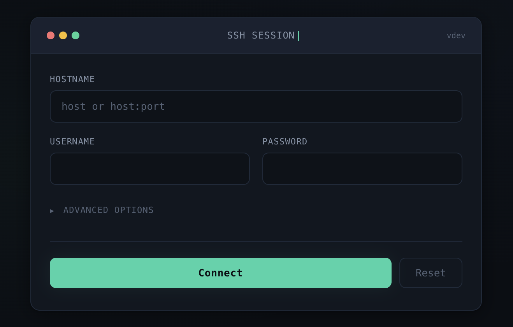

## WebSSH

A web-based SSH client with a modern terminal UI. Connect to SSH servers from your browser with password or key-based authentication, TOTP support, and optional per-user server-side key management.

Built on Python, Tornado, Paramiko, and xterm.js.



### Features

* Password and public-key authentication (RSA, ECDSA, Ed25519)
* Encrypted keys and TOTP two-factor authentication
* Per-user server-side SSH key generation and storage
* Per-user host lists and preferences that roam across browsers and machines
* YAML configuration with host allowlisting and host key pinning
* Hostname:port shortcut in the connect form
* Username pre-filled from auth proxy header
* Fullscreen, resizable terminal with auto-detected encoding
* Modern dark terminal-inspired UI

### How it works

```
+---------+     http     +--------+    ssh    +-----------+
| browser | <==========> | webssh | <=======> | ssh server|
+---------+   websocket  +--------+    ssh    +-----------+
```

### Quick Start with Docker

```bash
docker run -d -p 8888:8888 ghcr.io/rgregg/webssh:latest
```

Then open `http://localhost:8888` in your browser.

### Configuration

WebSSH uses a YAML config file for most settings. Mount it at `/data/config.yaml` and it will be loaded automatically:

```bash
docker run -d -p 8888:8888 \
  -v ./config.yaml:/data/config.yaml:ro \
  ghcr.io/rgregg/webssh:latest
```

Example `config.yaml`:

```yaml
# Host key policy: reject, autoadd, or warning (default: warning)
policy: reject

# Restrict connections to specific hosts
hosts:
  - name: "Production Server"
    hostname: "10.0.1.5"
    port: 22
    host_key:
      - "ssh-ed25519 AAAAC3NzaC1lZDI1NTE5AAAA..."
      - "ssh-rsa AAAAB3NzaC1yc2EAAAA..."
  - name: "Database Server"
    hostname: "db.internal"
    port: 3022

# Per-user SSH key management
userkeydir: /data/user-keys
userheader: X-Authentik-Username

# Trusted proxy IPs (required when userkeydir is set)
trusted_proxies:
  - 10.0.0.1
```

See [config.yaml.example](config.yaml.example) for all options.

#### Host Key Pinning

Pin expected host keys so connections are rejected if the server key doesn't match. Get a host's keys with:

```bash
ssh-keyscan -t ed25519,rsa hostname
```

Or generate a config from your existing `known_hosts`:

```bash
python scripts/known_hosts_to_yaml.py ~/.ssh/known_hosts > config.yaml
```

#### Per-User SSH Keys

When `userkeydir` is configured, authenticated users can generate Ed25519 key pairs on the server and use them for connections without uploading a key file each time. The user's public key is displayed in the UI for copying to `authorized_keys` on target hosts.

Requires an auth proxy (e.g. Authentik) that sets a username header.

### User-managed hosts

With `user_hosts: true`, each authenticated user gets a Settings tab where they
can add their own hosts and set terminal preferences. Both are stored on the
server under `userdatadir` (defaulting to `userkeydir`), so they follow the user
between browsers and machines.

**The `hosts:` allowlist above is a security boundary: it is the only thing
stopping an authenticated user from connecting anywhere. Turning on
`user_hosts` lets users add their own hosts outside that allowlist, so it stops
being a hard restriction.** If you rely on `hosts:` to restrict where users can
connect, leave `user_hosts` off.

```yaml
user_hosts: true
userdatadir: /var/lib/webssh/user-data
userheader: X-Authentik-Username
trusted_proxies:
  - 10.0.0.1
```

Administrator hosts from `hosts:` remain read-only and always take precedence: if
a user saves a host with the same hostname and port as an administrator entry,
the user's entry is dropped in its entirety and only the administrator's entry
is used — its host key pins, its username, and its default command. The user's
colliding entry still appears in their Settings tab, but it has no effect on
connections.

Requires an auth proxy that sets a username header; without one, `user_hosts`
has no effect. Set `trusted_proxies` so the header can't be spoofed — without
it, any client can claim any username and reach that user's stored hosts.

Secrets (passwords, TOTP codes, key passphrases) are never stored server-side,
whether for administrator or personal hosts.

### File transfer

Drag a file onto a connected terminal to upload it; use the download button
in the tab bar to fetch a file back. Transfers run over SFTP on the SSH
connection the terminal already authenticated, so they need no extra
credentials and carry exactly the permissions of the SSH user you connected
as.

Uploads land in the directory the shell is currently in, which WebSSH learns
from an OSC 7 sequence. Set `shell_integration: false` to disable that; the
destination is then requested with a prompt. Uploads never overwrite an
existing file without asking.

Transfers are capped at three at a time per session, and are cancelled if the
terminal tab is closed.

### Docker Compose

```yaml
services:
  webssh:
    image: ghcr.io/rgregg/webssh:latest
    ports:
      - "8888:8888"
    volumes:
      - ./config.yaml:/data/config.yaml:ro
      - webssh-keys:/data/user-keys
    restart: unless-stopped

volumes:
  webssh-keys:
```

### Deployment Behind a Reverse Proxy

```nginx
location / {
    proxy_pass http://webssh:8888;
    proxy_http_version 1.1;
    proxy_read_timeout 300;
    proxy_set_header Upgrade $http_upgrade;
    proxy_set_header Connection "upgrade";
    proxy_set_header Host $http_host;
    proxy_set_header X-Real-IP $remote_addr;
    proxy_set_header X-Real-PORT $remote_port;
}
```

### CLI Options

All settings can also be passed as command-line arguments:

```bash
wssh --address='0.0.0.0' --port=8888 --policy=reject --config=/data/config.yaml
```

Run `wssh --help` for the full list.

### URL Arguments

Pass connection parameters via URL query or fragment:

```
http://localhost:8888/?hostname=myserver&username=admin
http://localhost:8888/#bgcolor=green&fontsize=24&encoding=utf-8
http://localhost:8888/?title=my-server&command=htop&term=xterm-256color
```

### Development

Requirements: Python 3.10+

```bash
pip install -r requirements.txt
python run.py
```

Run tests:

```bash
pip install pytest
python -m pytest tests
```

Browser client tests require Node 20+ and install nothing:

```bash
node --test tests/js/*.test.js
```

They cover the pure decision logic in `webssh/static/js/user-hosts.js` — host
payload construction, port validation, settings merging, preference precedence,
and the legacy command migration. DOM behaviour in `main.js` (tab lifecycle, the
hostname input/select upgrade, asynchronous save sequencing) is not covered.
